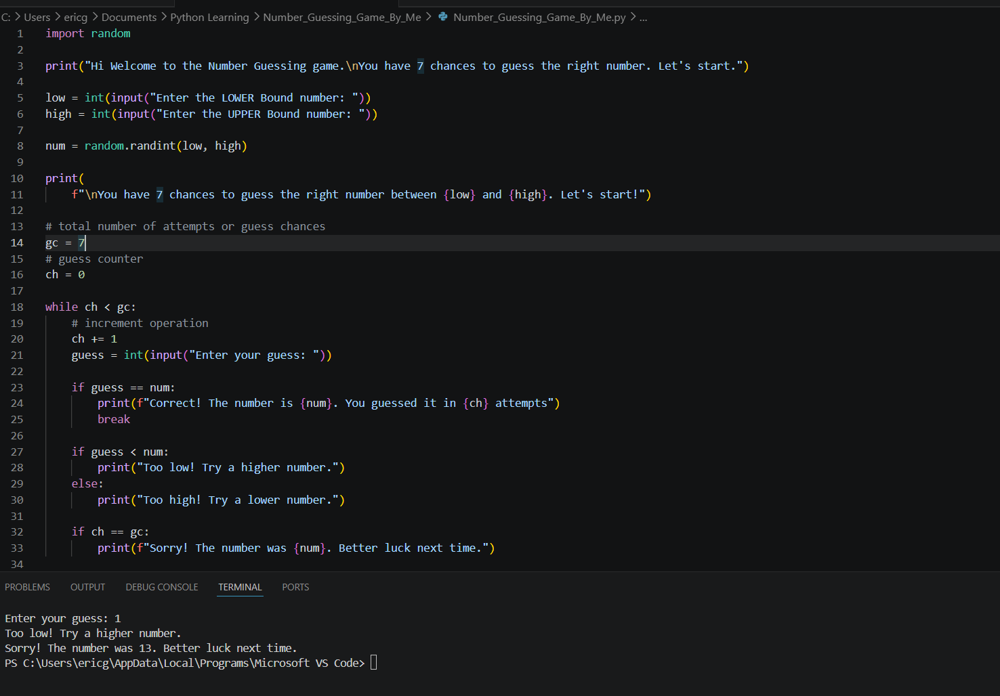

# 🎯 Number Guessing Game

A simple command-line Number Guessing Game built with Python.

## 📖 About

This project is part of my Python learning journey and software development portfolio.

After learning the fundamentals of Python through YouTube tutorials, I challenged myself to build this project on my own without following a tutorial step by step or relying on notes. My goal was to strengthen my understanding by solving problems independently and learning from my mistakes.

The idea for this project was inspired by the GeeksforGeeks Number Guessing Game:
https://www.geeksforgeeks.org/python/number-guessing-game-in-python/

## 🚀 Features

- User chooses the lower and upper bounds.
- Random number generation using Python's `random` module.
- Seven attempts to guess the correct number.
- Feedback after each guess ("Too High" or "Too Low").
- Displays a success message when the correct number is guessed.
- Reveals the correct number if all attempts are used.

## 🛠️ Technologies Used

- Python 3

## 📚 Concepts Practiced

- Variables
- User input (`input()`)
- Conditional statements (`if`, `elif`, `else`)
- `while` loops
- Random number generation
- Debugging syntax and logic errors

## ▶️ How to Run

1. Clone this repository:

```bash
git clone https://github.com/YOUR_USERNAME/python-number-guessing-game.git
```

2. Navigate to the project folder:

```bash
cd python-number-guessing-game
```

3. Run the program:

```bash
python number_guessing_game.py
```

## 📷 Screenshot

*Add a screenshot of your game here.*


Example:

```
Hi! Welcome to the Number Guessing Game.

Enter the LOWER Bound number: 1
Enter the UPPER Bound number: 100

You have 7 chances to guess the number.

Enter your guess: 50
Too high! Try a lower number.

Enter your guess: 25
Too low! Try a higher number.

Enter your guess: 37
Correct! The number is 37. You guessed it in 3 attempts.
```

## 🌱 What I Learned

This project helped me practice writing Python code without relying on notes. Along the way, I learned how to:

- Think through programming logic.
- Debug syntax and runtime errors.
- Read and understand Python error messages.
- Build confidence by solving problems independently.

## 🔮 Future Improvements

- Add difficulty levels.
- Allow the player to play again.
- Validate user input.
- Keep track of the best score.
- Refactor the code using functions and classes.

## 🙏 Acknowledgments

This project was inspired by the GeeksforGeeks **Number Guessing Game** tutorial. I used the project idea for practice while writing the code independently as part of my Python learning journey.
